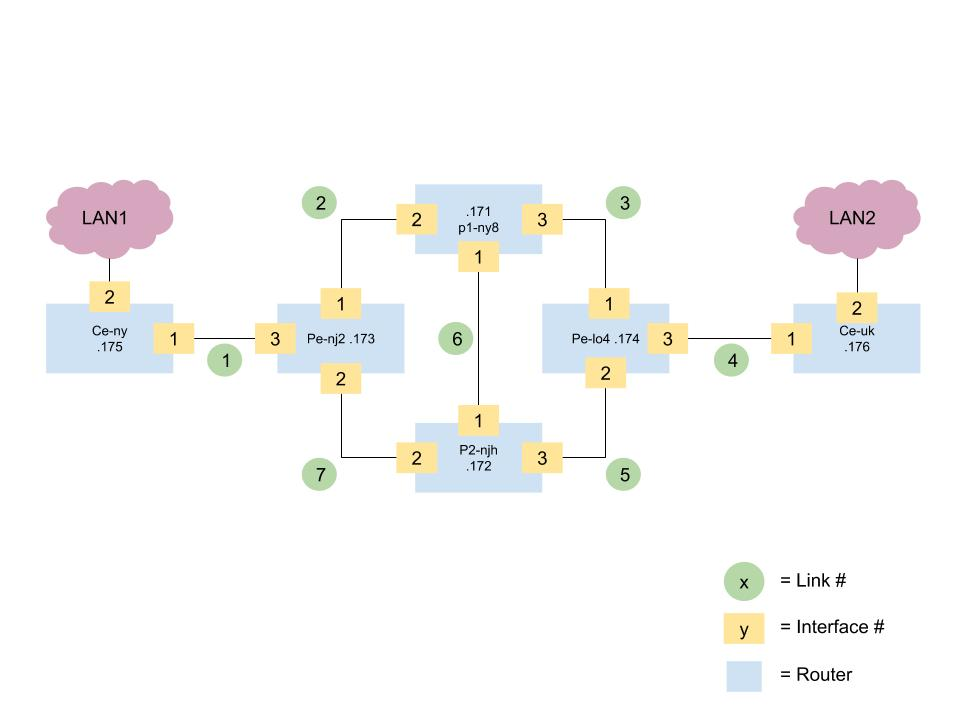

# Juniper MPLS Core with L3VPN

Based off of [Juniper MPLS Core with L3VPN](https://juniperlabs.wordpress.com/2014/01/16/simple-juniper-mpls-core-with-l3vpn/).

This is a document full of manual steps. Of course there are so many places to make mistakes that this is not a feasible thing to do in production, but this is the first variation of this workshop, and as it continues to evolve it will move towards as much automation is feasible.

## KVM Host

We are using Ubuntu 16.04 with the Ubuntu Cloud Archive for OpenStack Pike. We are not actually using Pike but we need later versions of various software, specifically libvirt. Without a later version of libvirt we do not get a libvirt that works with `numad` and can't use the `--cpuset=auto` to get numa placement.

## Network Diagram

In the below diagram the `.17x` numbers represent the IP address `192.168.122.17x` which are the managment interfaces, set onto fxp0.



## Requirements

* Juniper vSRX image - Create a Juniper account and download the image from Juniper
* A KVM based host to run all the virtual machines on - Should have enough memory to run all the VMs
* KVM host can run numad and libvirt that work together - So Ubuntu + OpenStack Pike Cloud Archive
* Some experience with the Juniper command line - Though mostly we will be copying and pasting commands
* Some experience using virsh and KVM

## Build Routers

### Create Backing Images

This lab uses this particular image version:

```
media-vsrx-vmdisk-17.3R1.10.qcow2
```

Other versions may work.

Install the vSRX image into `/var/lib/libvirt/images`. Then run the below.

```
cd /var/lib/libvirt/images

export ROUTERS="p1-ny8
p2-njh
pe-nj2
pe-lo4
ce-ny
ce-uk"

for r in ${ROUTERS}; do
  sudo qemu-img create -f qcow2 -b media-vsrx-vmdisk-17.3R1.10.qcow2 ${r}.img
done
```

### Network Links

This assumes mgmt/default already exists.

*NOTE: sjm = "simple juniper mpls", just to distinguish from other networks/links.*

```
export NETS="sjm-mgmt
sjm-link1
sjm-link2
sjm-link3
sjm-link4
sjm-link5
sjm-link6
sjm-link7
"

for n in $NETS; do

  cat <<EOF > $n.yml
  <network>
   <name>$n</name>
   <bridge name="br-$n" />
  </network>
EOF

  sudo virsh net-define $n.yml
  sudo virsh net-start $n
  sudo virsh net-autostart $n

  rm $n.yml
done
```

### Clone This Repository

```
git clone https://github.com/ccollicutt/mpls-networking
cd mpls-networking
```

### Build ISOs

This ISO is used by the vSRX to do setup an intial configuration.

```
cd ~/mpls-networking
export ROUTERS="p1-ny8
p2-njh
pe-nj2
pe-lo4
ce-ny
ce-uk"

for i in ${ROUTERS}; do
  sudo mkisofs -l -o /var/lib/libvirt/images/${i}.iso juniper-configs
done
```

### Install Routers

First, setup a variable for image location.

```
export IMG_PATH=/var/lib/libvirt/images
```

*NOTE: Adding `--cpuset=auto ` for numa.*

*NOTE: In the future this will be more automated. virt-install takes some time.*

*NOTE: The order of the network interfaces is important.*

ce-ny:

```
export IMG_PATH=/var/lib/libvirt/images
virt-install --name ce-ny \
--cpuset=auto \
--ram=4096 \
--cpu SandyBridge,+vmx,-invtsc \
--vcpus=2 \
--arch=x86_64 \
--disk path=${IMG_PATH}/ce-ny.img,size=16,device=disk,bus=ide,format=qcow2 \
--disk path=${IMG_PATH}/ce-ny.iso,device=cdrom,bus=ide \
--boot hd \
--os-type linux \
--os-variant rhel7 \
--network=network:default,model=virtio \
--network=network:sjm-mgmt,model=virtio \
--network=network:sjm-link1,model=virtio \
--import
```

ce-uk:

```
export IMG_PATH=/var/lib/libvirt/images
virt-install --name ce-uk \
--cpuset=auto \
--ram=4096 \
--cpu SandyBridge,+vmx,-invtsc \
--vcpus=2 \
--arch=x86_64 \
--disk path=${IMG_PATH}/ce-uk.img,size=16,device=disk,bus=ide,format=qcow2 \
--disk path=${IMG_PATH}/ce-uk.iso,device=cdrom,bus=ide \
--boot hd \
--os-type linux \
--os-variant rhel7 \
--network=network:default,model=virtio \
--network=network:sjm-mgmt,model=virtio \
--network=network:sjm-link4,model=virtio \
--import
```

p1-ny8:

```
export IMG_PATH=/var/lib/libvirt/images
virt-install --name p1-ny8 \
--cpuset=auto \
--ram=4096 \
--cpu SandyBridge,+vmx,-invtsc \
--vcpus=2 \
--arch=x86_64 \
--disk path=${IMG_PATH}/p1-ny8.img,size=16,device=disk,bus=ide,format=qcow2 \
--disk path=${IMG_PATH}/p1-ny8.iso,device=cdrom,bus=ide \
--boot hd \
--os-type linux \
--os-variant rhel7 \
--network=network:default,model=virtio \
--network=network:sjm-mgmt,model=virtio \
--network=network:sjm-link6,model=virtio \
--network=network:sjm-link2,model=virtio \
--network=network:sjm-link3,model=virtio \
--import
```

pe-nj2

```
export IMG_PATH=/var/lib/libvirt/images
virt-install --name pe-nj2 \
--cpuset=auto \
--ram=4096 \
--cpu SandyBridge,+vmx,-invtsc \
--vcpus=2 \
--arch=x86_64 \
--disk path=${IMG_PATH}/pe-nj2.img,size=16,device=disk,bus=ide,format=qcow2 \
--disk path=${IMG_PATH}/pe-nj2.iso,device=cdrom,bus=ide \
--boot hd \
--os-type linux \
--os-variant rhel7 \
--network=network:default,model=virtio \
--network=network:sjm-mgmt,model=virtio \
--network=network:sjm-link2,model=virtio \
--network=network:sjm-link7,model=virtio \
--network=network:sjm-link1,model=virtio \
--import
```

pe-lo4

```
export IMG_PATH=/var/lib/libvirt/images
virt-install --name pe-lo4 \
--cpuset=auto \
--ram=4096 \
--cpu SandyBridge,+vmx,-invtsc \
--vcpus=2 \
--arch=x86_64 \
--disk path=${IMG_PATH}/pe-lo4.img,size=16,device=disk,bus=ide,format=qcow2 \
--disk path=${IMG_PATH}/pe-lo4.iso,device=cdrom,bus=ide \
--boot hd \
--os-type linux \
--os-variant rhel7 \
--import \
--network=network:default,model=virtio \
--network=network:sjm-mgmt,model=virtio \
--network=network:sjm-link3,model=virtio \
--network=network:sjm-link5,model=virtio \
--network=network:sjm-link4,model=virtio \
--import
```

p2-njh:

```
export IMG_PATH=/var/lib/libvirt/images
virt-install --name p2-njh \
--cpuset=auto \
--ram=4096 \
--cpu SandyBridge,+vmx,-invtsc \
--vcpus=2 \
--arch=x86_64 \
--disk path=${IMG_PATH}/p2-njh.img,size=16,device=disk,bus=ide,format=qcow2 \
--disk path=${IMG_PATH}/p2-njh.iso,device=cdrom,bus=ide \
--boot hd \
--os-type linux \
--os-variant rhel7 \
--network=network:default,model=virtio \
--network=network:sjm-mgmt,model=virtio \
--network=network:sjm-link6,model=virtio \
--network=network:sjm-link7,model=virtio \
--network=network:sjm-link5,model=virtio \
--import
```

Power off each after creating, then restart them.

Login to each router and run:

FIXME: validate this command

```
cli> request system power-off
```

Now restart them.

```
virsh start some_router
```

## Setup Hosts File

Make it a bit easier to login to nodes via ssh.

```
192.168.122.171   p1-ny8
192.168.122.172   p2-njh
192.168.122.173   pe-nj2
192.168.122.174   pe-lo4
192.168.122.175   ce-ny
192.168.122.176   ce-uk
```

```
export ROUTERS="p1-ny8
p2-njh
pe-nj2
pe-lo4
ce-ny
ce-uk"

for r in ${ROUTERS}; do
  if ping -c 3 -w 5 ${r} > /dev/null; then
    echo "${r} is alive"
  else
    echo "${r} is DEAD"
  fi
done
```

## Configure Routers

Note that some basic configuration was injected into the router during the virt-install phase via a juniper.conf file in the ISO that is setup as the cdrom drive. However, no IP addresses were configured for access.

### p1-ny8

Connect via `virsh console`.

```
virsh console p1-ny8
```

Login information:

```
login: root
password: P@ssw0rd
```

First set fxp0:

```
set interfaces fxp0 unit 0 family inet address 192.168.122.171/24
```

Then ssh in and run the below:

*NOTE: If you try to copy and paste via the virsh console, it will often not be able to accept all the characters and some commands will not be executed.*

```
set system host-name p1-ny8
set system services ssh
set system syslog user * any emergency
set system syslog file messages any any
set system syslog file messages authorization info
set system syslog file interactive-commands interactive-commands any
set system license autoupdate url https://ae1.juniper.net/junos/key_retrieval
set interfaces ge-0/0/0 unit 0 family inet address 10.100.1.171/24
set interfaces ge-0/0/1 unit 0 family inet address 10.1.2.0/31
set interfaces ge-0/0/2 unit 0 family inet address 10.1.3.0/31
set interfaces ge-0/0/3 unit 0 family inet address 10.1.4.0/31
set interfaces lo0 unit 0 family inet address 1.1.1.1/32
##set security forwarding-options family mpls mode packet-based
set routing-instances manage instance-type virtual-router
set routing-instances manage interface ge-0/0/0.0
```

eg.

```
root# show | compare
[edit system]
+  host-name p1-ny8;
[edit interfaces]
+   ge-0/0/0 {
+       unit 0 {
+           family inet {
+               address 10.100.1.171/24;
+           }
+       }
+   }
+   ge-0/0/1 {
+       unit 0 {
+           family inet {
+               address 10.1.2.0/31;
+           }
+       }
+   }
+   ge-0/0/2 {
+       unit 0 {
+           family inet {
+               address 10.1.3.0/31;
+           }
+       }
+   }
+   ge-0/0/3 {
+       unit 0 {
+           family inet {
+               address 10.1.4.0/31;
+           }
+       }
+   }
+   lo0 {
+       unit 0 {
+           family inet {
+               address 1.1.1.1/32;
+           }
+       }
+   }
[edit]
+  routing-instances {
+      manage {
+          instance-type virtual-router;
+          interface ge-0/0/0.0;
+      }
+  }

```

### p2-njh

First set fxp0:

```
set interfaces fxp0 unit 0 family inet address 192.168.122.172/24
```

Next, ssh in and run:

```
##set version 12.1X44.3
set system host-name p2-njh
set system services ssh
set system syslog user * any emergency
set system syslog file messages any any
set system syslog file messages authorization info
set system syslog file interactive-commands interactive-commands any
set system license autoupdate url https://ae1.juniper.net/junos/key_retrieval
set interfaces ge-0/0/0 unit 0 family inet address 10.100.1.172/24
set interfaces ge-0/0/1 unit 0 family inet address 10.1.2.1/31
set interfaces ge-0/0/2 unit 0 family inet address 10.2.3.0/31
set interfaces ge-0/0/3 unit 0 family inet address 10.2.4.0/31
set interfaces lo0 unit 0 family inet address 2.2.2.2/32
set security forwarding-options family mpls mode packet-based
set routing-instances manage instance-type virtual-router
set routing-instances manage interface ge-0/0/0.0
```

eg.

```
root# show | compare
[edit system]
+  host-name p2-njh;
[edit interfaces]
+   ge-0/0/0 {
+       unit 0 {
+           family inet {
+               address 10.100.1.172/24;
+           }
+       }
+   }
+   ge-0/0/1 {
+       unit 0 {
+           family inet {
+               address 10.1.2.1/31;
+           }
+       }
+   }
+   ge-0/0/2 {
+       unit 0 {
+           family inet {
+               address 10.2.3.0/31;
+           }
+       }
+   }
+   ge-0/0/3 {
+       unit 0 {
+           family inet {
+               address 10.2.4.0/31;
+           }
+       }
+   }
+   lo0 {
+       unit 0 {
+           family inet {
+               address 2.2.2.2/32;
+           }
+       }
+   }
[edit]
+  routing-instances {
+      manage {
+          instance-type virtual-router;
+          interface ge-0/0/0.0;
+      }
+  }
```

###  pe-nj2


```
set interfaces fxp0 unit 0 family inet address 192.168.122.173/24
```

Then set via ssh:

```
##set version 12.1X44.3
set system host-name pe-nj2
set system services ssh
set system syslog user * any emergency
set system syslog file messages any any
set system syslog file messages authorization info
set system syslog file interactive-commands interactive-commands any
set system license autoupdate url https://ae1.juniper.net/junos/key_retrieval
set interfaces ge-0/0/0 unit 0 family inet address 10.100.1.173/24
set interfaces ge-0/0/1 unit 0 family inet address 10.1.3.1/31
set interfaces ge-0/0/2 unit 0 family inet address 10.2.3.1/31
set interfaces lo0 unit 0 family inet address 3.3.3.3/32
##set security forwarding-options family mpls mode packet-based
set routing-instances manage instance-type virtual-router
set routing-instances manage interface ge-0/0/0.0
```

eg.

```
root# show | compare                                               
[edit system]
+  host-name pe-nj2;
[edit interfaces]
+   ge-0/0/0 {
+       unit 0 {
+           family inet {
+               address 10.100.1.173/24;
+           }
+       }
+   }
+   ge-0/0/1 {
+       unit 0 {
+           family inet {
+               address 10.1.3.1/31;
+           }
+       }
+   }
+   ge-0/0/2 {
+       unit 0 {
+           family inet {
+               address 10.2.3.1/31;
+           }
+       }
+   }
+   lo0 {
+       unit 0 {
+           family inet {
+               address 3.3.3.3/32;
+           }
+       }
+   }
[edit]
+  routing-instances {
+      manage {
+          instance-type virtual-router;
+          interface ge-0/0/0.0;
+      }
+  }

[edit]
```

### pe-lo4

```
set interfaces fxp0 unit 0 family inet address 192.168.122.174/24
```

```
##set version 12.1X44.3
set system host-name pe-lo4
set system services ssh
set system syslog user * any emergency
set system syslog file messages any any
set system syslog file messages authorization info
set system syslog file interactive-commands interactive-commands any
set system license autoupdate url https://ae1.juniper.net/junos/key_retrieval
set interfaces ge-0/0/0 unit 0 family inet address 10.100.1.174/24
set interfaces ge-0/0/1 unit 0 family inet address 10.1.4.1/31
set interfaces ge-0/0/2 unit 0 family inet address 10.2.4.1/31
set interfaces lo0 unit 0 family inet address 4.4.4.4/32
##set security forwarding-options family mpls mode packet-based
set routing-instances manage instance-type virtual-router
set routing-instances manage interface ge-0/0/0.0
```

eg.

```
root# show | compare
[edit system]
+  host-name pe-lo4;
[edit interfaces]
+   ge-0/0/0 {
+       unit 0 {
+           family inet {
+               address 10.100.1.174/24;
+           }
+       }
+   }
+   ge-0/0/1 {
+       unit 0 {
+           family inet {
+               address 10.1.4.1/31;
+           }
+       }
+   }
+   ge-0/0/2 {
+       unit 0 {
+           family inet {
+               address 10.2.4.1/31;
+           }
+       }
+   }
+   lo0 {
+       unit 0 {
+           family inet {
+               address 4.4.4.4/32;
+           }
+       }
+   }
[edit]
+  routing-instances {
+      manage {
+          instance-type virtual-router;
+          interface ge-0/0/0.0;
+      }
+  }

[edit]
```

### ce-ny

```
set interfaces fxp0 unit 0 family inet address 192.168.122.175/24
```


```
##set version 12.1X44.3
set system host-name ce-ny
set system services ssh
set system syslog user * any emergency
set system syslog file messages any any
set system syslog file messages authorization info
set system syslog file interactive-commands interactive-commands any
set system license autoupdate url https://ae1.juniper.net/junos/key_retrieval
set interfaces ge-0/0/0 unit 0 family inet address 10.100.1.175/24
set interfaces lo0 unit 0 family inet address 5.5.5.5/32
##set security forwarding-options family mpls mode packet-based
set routing-instances manage instance-type virtual-router
set routing-instances manage interface ge-0/0/0.0
```

### ce-uk

```
set interfaces fxp0 unit 0 family inet address 192.168.122.176/24
```

```
##set version 12.1X44.3
set system host-name ce-uk
set system services ssh
set system syslog user * any emergency
set system syslog file messages any any
set system syslog file messages authorization info
set system syslog file interactive-commands interactive-commands any
set system license autoupdate url https://ae1.juniper.net/junos/key_retrieval
set interfaces ge-0/0/0 unit 0 family inet address 10.100.1.176/24
set interfaces lo0 unit 0 family inet address 6.6.6.6/32
##set security forwarding-options family mpls mode packet-based
set routing-instances manage instance-type virtual-router
set routing-instances manage interface ge-0/0/0.0
```

## Configure Dynamic Routing

### p1-ny8

```
set routing-options router-id 1.1.1.1
set protocols ospf area 0.0.0.0 interface lo0.0 passive
set protocols ospf area 0.0.0.0 interface ge-0/0/1.0
set protocols ospf area 0.0.0.0 interface ge-0/0/2.0
set protocols ospf area 0.0.0.0 interface ge-0/0/3.0
```

### p2-njh

```
set routing-options router-id 2.2.2.2
set protocols ospf area 0.0.0.0 interface lo0.0 passive
set protocols ospf area 0.0.0.0 interface ge-0/0/1.0
set protocols ospf area 0.0.0.0 interface ge-0/0/2.0
set protocols ospf area 0.0.0.0 interface ge-0/0/3.0
```

### pe-nj2

```
set routing-options router-id 3.3.3.3
set protocols ospf area 0.0.0.0 interface lo0.0 passive
set protocols ospf area 0.0.0.0 interface ge-0/0/1.0
set protocols ospf area 0.0.0.0 interface ge-0/0/2.0
```

### pe-lo4

```
set routing-options router-id 4.4.4.4
set protocols ospf area 0.0.0.0 interface lo0.0 passive
set protocols ospf area 0.0.0.0 interface ge-0/0/1.0
set protocols ospf area 0.0.0.0 interface ge-0/0/2.0
```

### OSP Neighbors

```
root@p1-ny8> show ospf neighbor    
Address          Interface              State     ID               Pri  Dead
10.1.2.1         ge-0/0/1.0             Full      2.2.2.2          128    32
10.1.3.1         ge-0/0/2.0             Full      3.3.3.3          128    36
10.1.4.1         ge-0/0/3.0             Full      4.4.4.4          128    32
```

```
root@p2-njh> show ospf neighbor
Address          Interface              State     ID               Pri  Dead
10.1.2.0         ge-0/0/1.0             Full      1.1.1.1          128    31
10.2.3.1         ge-0/0/2.0             Full      3.3.3.3          128    34
10.2.4.1         ge-0/0/3.0             Full      4.4.4.4          128    33
```

```
root@pe-lo4> show ospf neighbor
Address          Interface              State     ID               Pri  Dead
10.1.4.0         ge-0/0/1.0             Full      1.1.1.1          128    38
10.2.4.0         ge-0/0/2.0             Full      2.2.2.2          128    34
```

```
root@pe-nj2> show ospf neighbor
Address          Interface              State     ID               Pri  Dead
10.1.3.0         ge-0/0/1.0             Full      1.1.1.1          128    33
10.2.3.0         ge-0/0/2.0             Full      2.2.2.2          128    16
```

## Setup BGP Between PE Routers

pe-nj2:

```
set routing-options autonomous-system 65000
set protocols bgp group pe type internal
set protocols bgp group pe local-address 3.3.3.3
set protocols bgp group pe family inet-vpn any
set protocols bgp group pe neighbor 4.4.4.4
```

```
root@pe-nj2# show | compare
[edit routing-options]
+   autonomous-system 65000;
[edit protocols]
+   bgp {
+       group pe {
+           type internal;
+           local-address 3.3.3.3;
+           family inet-vpn {
+               any;
+           }
+           neighbor 4.4.4.4;
+       }
+   }

[edit]
```

pe-lo4:

```
set routing-options autonomous-system 65000
set protocols bgp group pe type internal
set protocols bgp group pe local-address 4.4.4.4
set protocols bgp group pe family inet-vpn any
set protocols bgp group pe neighbor 3.3.3.3
```

```
root@pe-lo4# show |compare
[edit routing-options]
+   autonomous-system 65000;
[edit protocols]
+   bgp {
+       group pe {
+           type internal;
+           local-address 4.4.4.4;
+           family inet-vpn {
+               any;
+           }
+           neighbor 3.3.3.3;
+       }
+   }

[edit]
```

### Validate

```
root@pe-nj2> show bgp summary
Groups: 1 Peers: 1 Down peers: 0
Table          Tot Paths  Act Paths Suppressed    History Damp State    Pending
bgp.l3vpn.0          
                       0          0          0          0          0          0
bgp.l3vpn.2          
                       0          0          0          0          0          0
Peer                     AS      InPkt     OutPkt    OutQ   Flaps Last Up/Dwn State|#Active/Received/Accepted/Damped...
4.4.4.4               65000          6          2       0       0        1:10 Establ
  bgp.l3vpn.0: 0/0/0/0
  bgp.l3vpn.2: 0/0/0/0

root@pe-nj2>
```

```
root@pe-nj2> show bgp neighbor    
Peer: 4.4.4.4+56744 AS 65000   Local: 3.3.3.3+179 AS 65000
  Group: pe                    Routing-Instance: master
  Forwarding routing-instance: master  
  Type: Internal    State: Established    Flags: <Sync>
  Last State: OpenConfirm   Last Event: RecvKeepAlive
  Last Error: None
  Options: <Preference LocalAddress AddressFamily Rib-group Refresh>
  Address families configured: inet-vpn-unicast inet-vpn-multicast
  Local Address: 3.3.3.3 Holdtime: 90 Preference: 170
  Number of flaps: 0
  Peer ID: 4.4.4.4         Local ID: 3.3.3.3           Active Holdtime: 90
  Keepalive Interval: 30         Group index: 0    Peer index: 0    SNMP index: 0     
  I/O Session Thread: bgpio-0 State: Enabled
  BFD: disabled, down
  NLRI for restart configured on peer: inet-vpn-unicast inet-vpn-multicast
  NLRI advertised by peer: inet-vpn-unicast inet-vpn-multicast
  NLRI for this session: inet-vpn-unicast inet-vpn-multicast
  Peer supports Refresh capability (2)
  Stale routes from peer are kept for: 300
  Peer does not support Restarter functionality
  Restart flag received from the peer: Notification
  NLRI that restart is negotiated for: inet-vpn-unicast inet-vpn-multicast
  NLRI of received end-of-rib markers: inet-vpn-unicast inet-vpn-multicast
  NLRI of all end-of-rib markers sent: inet-vpn-unicast inet-vpn-multicast
```


```
root@pe-lo4> show bgp summary
Groups: 1 Peers: 1 Down peers: 0
Table          Tot Paths  Act Paths Suppressed    History Damp State    Pending
bgp.l3vpn.0          
                       0          0          0          0          0          0
bgp.l3vpn.2          
                       0          0          0          0          0          0
Peer                     AS      InPkt     OutPkt    OutQ   Flaps Last Up/Dwn State|#Active/Received/Accepted/Damped...
3.3.3.3               65000          4          1       0       0          52 Establ
  bgp.l3vpn.0: 0/0/0/0
  bgp.l3vpn.2: 0/0/0/0
```

```
root@pe-lo4> show bgp neighbor
Peer: 3.3.3.3+179 AS 65000     Local: 4.4.4.4+56744 AS 65000
  Group: pe                    Routing-Instance: master
  Forwarding routing-instance: master  
  Type: Internal    State: Established    Flags: <Sync>
  Last State: OpenConfirm   Last Event: RecvKeepAlive
  Last Error: None
  Options: <Preference LocalAddress AddressFamily Rib-group Refresh>
  Address families configured: inet-vpn-unicast inet-vpn-multicast
  Local Address: 4.4.4.4 Holdtime: 90 Preference: 170
  Number of flaps: 0
  Peer ID: 3.3.3.3         Local ID: 4.4.4.4           Active Holdtime: 90
  Keepalive Interval: 30         Group index: 0    Peer index: 0    SNMP index: 0     
  I/O Session Thread: bgpio-0 State: Enabled
  BFD: disabled, down
  NLRI for restart configured on peer: inet-vpn-unicast inet-vpn-multicast
  NLRI advertised by peer: inet-vpn-unicast inet-vpn-multicast
  NLRI for this session: inet-vpn-unicast inet-vpn-multicast
  Peer supports Refresh capability (2)
  Stale routes from peer are kept for: 300
  Peer does not support Restarter functionality
  Restart flag received from the peer: Notification
  NLRI that restart is negotiated for: inet-vpn-unicast inet-vpn-multicast
  NLRI of received end-of-rib markers: inet-vpn-unicast inet-vpn-multicast
  NLRI of all end-of-rib markers sent: inet-vpn-unicast inet-vpn-multicast
  Peer does not support LLGR Restarter functionality
  Peer supports 4 byte AS extension (peer-as 65000)
  Peer does not support Addpath
  Table bgp.l3vpn.0
    RIB State: BGP restart is complete
    RIB State: VPN restart is complete
    Send state: not advertising
    Active prefixes:              0
    Received prefixes:            0
    Accepted prefixes:            0
    Suppressed due to damping:    0
  Table bgp.l3vpn.2
    RIB State: BGP restart is complete
    RIB State: VPN restart is complete
    Send state: not advertising
    Active prefixes:              0
    Received prefixes:            0
    Accepted prefixes:            0
    Suppressed due to damping:    0
  Last traffic (seconds): Received 2533 Sent 15   Checked 2533
  Input messages:  Total 3      Updates 2       Refreshes 0     Octets 79
  Output messages: Total 1      Updates 0       Refreshes 0     Octets 79
```
## Setup MPLS

###  p1-ny8 and p2-njh

```
set interfaces ge-0/0/1.0 family mpls
set interfaces ge-0/0/2.0 family mpls
set interfaces ge-0/0/3.0 family mpls
set protocols ldp interface ge-0/0/1.0
set protocols ldp interface ge-0/0/2.0
set protocols ldp interface ge-0/0/3.0
set protocols mpls interface ge-0/0/1.0
set protocols mpls interface ge-0/0/2.0
set protocols mpls interface ge-0/0/3.0
```

```
root@p1-ny8# show | compare
[edit interfaces ge-0/0/1 unit 0]
+      family mpls;
[edit interfaces ge-0/0/2 unit 0]
+      family mpls;
[edit interfaces ge-0/0/3 unit 0]
+      family mpls;
[edit protocols]
+   mpls {
+       interface ge-0/0/1.0;
+       interface ge-0/0/2.0;
+       interface ge-0/0/3.0;
+   }
+   ldp {
+       interface ge-0/0/1.0;
+       interface ge-0/0/2.0;
+       interface ge-0/0/3.0;
+   }

[edit]
```

```
root@p2-njh# show | compare
[edit interfaces ge-0/0/1 unit 0]
+      family mpls;
[edit interfaces ge-0/0/2 unit 0]
+      family mpls;
[edit interfaces ge-0/0/3 unit 0]
+      family mpls;
[edit protocols]
+   mpls {
+       interface ge-0/0/1.0;
+       interface ge-0/0/2.0;
+       interface ge-0/0/3.0;
+   }
+   ldp {
+       interface ge-0/0/1.0;
+       interface ge-0/0/2.0;
+       interface ge-0/0/3.0;
+   }

[edit]
```

### pe-nj2 and pe-lo4:

```
set interfaces ge-0/0/1.0 family mpls
set interfaces ge-0/0/2.0 family mpls
set protocols ldp interface ge-0/0/1.0
set protocols ldp interface ge-0/0/2.0
set protocols mpls interface ge-0/0/1.0
set protocols mpls interface ge-0/0/2.0
```

```
root@pe-nj2# show | compare
[edit interfaces ge-0/0/1 unit 0]
+      family mpls;
[edit interfaces ge-0/0/2 unit 0]
+      family mpls;
[edit protocols]
+   mpls {
+       interface ge-0/0/1.0;
+       interface ge-0/0/2.0;
+   }
+   ldp {
+       interface ge-0/0/1.0;
+       interface ge-0/0/2.0;
+   }

[edit]
```

```
root@pe-lo4# show | compare
[edit interfaces ge-0/0/1 unit 0]
+      family mpls;
[edit interfaces ge-0/0/2 unit 0]
+      family mpls;
[edit protocols]
+   mpls {
+       interface ge-0/0/1.0;
+       interface ge-0/0/2.0;
+   }
+   ldp {
+       interface ge-0/0/1.0;
+       interface ge-0/0/2.0;
+   }

[edit]
```

### Validate

```
root@p1-ny8> show ldp database | no-more
Input label database, 1.1.1.1:0--2.2.2.2:0
Labels received: 4
  Label     Prefix
 299776      1.1.1.1/32
      3      2.2.2.2/32
 299792      3.3.3.3/32
 299808      4.4.4.4/32

Output label database, 1.1.1.1:0--2.2.2.2:0
Labels advertised: 4
  Label     Prefix
      3      1.1.1.1/32
 299776      2.2.2.2/32
 299792      3.3.3.3/32
 299808      4.4.4.4/32

Input label database, 1.1.1.1:0--3.3.3.3:0
Labels received: 4
  Label     Prefix
 299776      1.1.1.1/32
 299792      2.2.2.2/32
      3      3.3.3.3/32
 299808      4.4.4.4/32

Output label database, 1.1.1.1:0--3.3.3.3:0
Labels advertised: 4
  Label     Prefix
      3      1.1.1.1/32
 299776      2.2.2.2/32
 299792      3.3.3.3/32
 299808      4.4.4.4/32

Input label database, 1.1.1.1:0--4.4.4.4:0
Labels received: 4
  Label     Prefix
 299776      1.1.1.1/32
 299808      2.2.2.2/32
 299792      3.3.3.3/32
      3      4.4.4.4/32

Output label database, 1.1.1.1:0--4.4.4.4:0
Labels advertised: 4
  Label     Prefix
      3      1.1.1.1/32
 299776      2.2.2.2/32
 299792      3.3.3.3/32
 299808      4.4.4.4/32

```

## Setup VRFs

pe-nj2:

```
set interfaces ge-0/0/3.0 family inet address 10.3.5.0/31
set routing-instances VRF1 instance-type vrf
set routing-instances VRF1 interface ge-0/0/3.0
set routing-instances VRF1 route-distinguisher 3.3.3.3:1
set routing-instances VRF1 vrf-target target:65000:1
set routing-instances VRF1 protocols bgp group ce type external
set routing-instances VRF1 protocols bgp group ce peer-as 65100
set routing-instances VRF1 protocols bgp group ce neighbor 10.3.5.1
```

```
root@pe-nj2# show |compare
[edit interfaces]
+   ge-0/0/3 {
+       unit 0 {
+           family inet {
+               address 10.3.5.0/31;
+           }
+       }
+   }
[edit routing-instances]
+   VRF1 {
+       instance-type vrf;
+       interface ge-0/0/3.0;
+       route-distinguisher 3.3.3.3:1;
+       vrf-target target:65000:1;
+       protocols {
+           bgp {
+               group ce {
+                   type external;
+                   peer-as 65100;
+                   neighbor 10.3.5.1;
+               }
+           }
+       }
+   }

[edit]
```

pe-lo4:

```
set interfaces ge-0/0/3.0 family inet address 10.4.6.0/31
set routing-instances VRF1 instance-type vrf
set routing-instances VRF1 interface ge-0/0/3.0
set routing-instances VRF1 route-distinguisher 4.4.4.4:1
set routing-instances VRF1 vrf-target target:65000:1
set routing-instances VRF1 protocols bgp group ce type external
set routing-instances VRF1 protocols bgp group ce peer-as 65200
set routing-instances VRF1 protocols bgp group ce neighbor 10.4.6.1
```

```
root@pe-lo4# show | compare
[edit interfaces]
+   ge-0/0/3 {
+       unit 0 {
+           family inet {
+               address 10.4.6.0/31;
+           }
+       }
+   }
[edit routing-instances]
+   VRF1 {
+       instance-type vrf;
+       interface ge-0/0/3.0;
+       route-distinguisher 4.4.4.4:1;
+       vrf-target target:65000:1;
+       protocols {
+           bgp {
+               group ce {
+                   type external;
+                   peer-as 65200;
+                   neighbor 10.4.6.1;
+               }
+           }
+       }
+   }

[edit]
```

## Setup CE Routers

ce-ny:

```
set routing-options autonomous-system 65100
set interfaces ge-0/0/1.0 family inet address 10.3.5.1/31
set policy-options policy-statement export-connected term 1 from protocol direct
set policy-options policy-statement export-connected term 1 then accept
set protocols bgp group to-pe type external
set protocols bgp group to-pe export export-connected
set protocols bgp group to-pe peer-as 65000
set protocols bgp group to-pe neighbor 10.3.5.0
```

```
root@ce-ny# show | compare
[edit interfaces]
+   ge-0/0/1 {
+       unit 0 {
+           family inet {
+               address 10.3.5.1/31;
+           }
+       }
+   }
[edit]
+  routing-options {
+      autonomous-system 65100;
+  }
+  protocols {
+      bgp {
+          group to-pe {
+              type external;
+              export export-connected;
+              peer-as 65000;
+              neighbor 10.3.5.0;
+          }
+      }
+  }
+  policy-options {
+      policy-statement export-connected {
+          term 1 {
+              from protocol direct;
+              then accept;
+          }
+      }
+  }

[edit]
```

ce-uk:

```
set routing-options autonomous-system 65200
set interfaces ge-0/0/1.0 family inet address 10.4.6.1/31
set policy-options policy-statement export-connected term 1 from protocol direct
set policy-options policy-statement export-connected term 1 then accept
set protocols bgp group to-pe type external
set protocols bgp group to-pe export export-connected
set protocols bgp group to-pe peer-as 65000
set protocols bgp group to-pe neighbor 10.4.6.0
```

```
root@ce-uk# show |compare
[edit interfaces]
+   ge-0/0/1 {
+       unit 0 {
+           family inet {
+               address 10.4.6.1/31;
+           }
+       }
+   }
[edit]
+  routing-options {
+      autonomous-system 65200;
+  }
+  protocols {
+      bgp {
+          group to-pe {
+              type external;
+              export export-connected;
+              peer-as 65000;
+              neighbor 10.4.6.0;
+          }
+      }
+  }
+  policy-options {
+      policy-statement export-connected {
+          term 1 {
+              from protocol direct;
+              then accept;
+          }
+      }
+  }

[edit]
```

### Validate

W00T!

```
root@ce-ny> ping 6.6.6.6
PING 6.6.6.6 (6.6.6.6): 56 data bytes
64 bytes from 6.6.6.6: icmp_seq=0 ttl=61 time=5.112 ms
64 bytes from 6.6.6.6: icmp_seq=1 ttl=61 time=3.847 ms
64 bytes from 6.6.6.6: icmp_seq=2 ttl=61 time=3.834 ms
^C
--- 6.6.6.6 ping statistics ---
3 packets transmitted, 3 packets received, 0% packet loss
round-trip min/avg/max/stddev = 3.834/4.264/5.112/0.599 ms

root@ce-ny>
```

Traceroute:

*NOTE: MPLS label in traceroute output.*

```
root@ce-ny% traceroute 6.6.6.6
traceroute to 6.6.6.6 (6.6.6.6), 30 hops max, 40 byte packets
 1  10.3.5.0 (10.3.5.0)  5.770 ms  4.393 ms  3.180 ms
 2  * * *
 3  10.1.4.1 (10.1.4.1)  8.873 ms  5.861 ms  6.177 ms
     MPLS Label=299824 CoS=0 TTL=1 S=1
 4  6.6.6.6 (6.6.6.6)  6.612 ms  5.782 ms  5.198 ms
```

If we set:

```
set protocols mpls icmp-tunneling
```

on the P routers, then the output looks like the below:

```
root@ce-ny> traceroute 6.6.6.6
traceroute to 6.6.6.6 (6.6.6.6), 30 hops max, 40 byte packets
 1  10.3.5.0 (10.3.5.0)  4.755 ms  4.271 ms  4.355 ms
 2  10.2.3.0 (10.2.3.0)  6.592 ms  5.209 ms  5.805 ms
     MPLS Label=299776 CoS=0 TTL=1 S=0
     MPLS Label=299776 CoS=0 TTL=1 S=1
 3  10.2.4.1 (10.2.4.1)  6.009 ms  5.039 ms  4.873 ms
     MPLS Label=299776 CoS=0 TTL=1 S=1
 4  6.6.6.6 (6.6.6.6)  6.100 ms  4.285 ms  4.550 ms
```

## Conclusion

At this point a multiple Juniper routers have been built and configured with MPLS, and we can ping one CE router from another and see MPLS lables.

## Teardown

Remove routers.

```
export ROUTERS="p1-ny8
p2-njh
pe-nj2
pe-lo4
ce-ny
ce-uk"

for r in ${ROUTERS}; do
  virsh destroy ${r}
  virsh undefine ${r}
  cd /var/lib/libvirt/images
  rm -f ${r}.img
  rm -f ${r}.iso
done
```

Remove networks:

```
export NETS="sjm-mgmt
sjm-link1
sjm-link2
sjm-link3
sjm-link4
sjm-link5
sjm-link6
sjm-link7
"

for n in ${NETS}; do
  virsh net-destroy ${n}
  virsh net-undefine ${n}
done
```

## Issues

### Routers "going away"

At some point some routers seem to stop responding, including access to `virsh console`. They need to be hard restarted. Not sure what is causing this.

This may be linked to numad.

## Links

* [vSRX load initial config with kvm](https://www.juniper.net/documentation/en_US/vsrx/topics/task/configuration/security-vsrx-kvm-bootstrap-config.html)
* [Juniper vSRX Vagrant Libvirt](https://codingpackets.com/blog/juniper-vsrx-vagrant-libvirt-box-install/)
